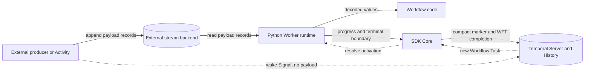
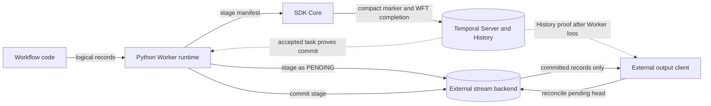

# High-level architecture

External Workflow Streams add a data plane beside Temporal and a small coordination plane through
the SDKs. Payloads use the data plane; Temporal History records only enough information to reproduce
the Workflow's observations.

## Input direction

An external producer appends payload records directly to the backend. The Python Worker reads and
decodes them, while Core decides when the open Workflow Task can accept readiness and when the task
must be completed. If no open task can accept readiness, a raw Temporal Signal creates server-visible
work; it contains only stream identity and wakeup metadata.



The normal low-latency path is local: a cached Run with an open Workflow Task receives readiness
directly through Core. The Signal path is the fallback when the task is parked, already completed, or
the Run is no longer cached on that Worker.

Normative details: [`wft-lifecycle.md`](../spec/wft-lifecycle.md),
[`core-lang-protocol.md`](../spec/core-lang-protocol.md), and
[`wake-signal.md`](../spec/wake-signal.md).

## Output direction

Workflow code produces logical output without receiving backend offsets. The Worker stages that
output as unreadable pending data, and Core places a compact commit proof in the Workflow Task's
marker. After the server accepts the task, the stage can become visible. If the Worker disappears in
between, a reader or reconciler reaches the same decision from History.



Activities and ordinary external processes can also append already-committed output directly. That
path does not need a Workflow Task commit proof, but it cannot pass an unresolved Workflow stage on
the same topic.

Normative details: [`backend-contract.md`](../spec/backend-contract.md),
[`annotation-format.md`](../spec/annotation-format.md), and
[`python-runtime.md`](../spec/python-runtime.md).

## Responsibility boundaries

| Component | Owns | Deliberately does not own |
|---|---|---|
| Workflow code | Subscriptions, consumption, logical output, deterministic control flow | Backend connections, provider offsets, wake Signals |
| Python runtime | Backend I/O, conversion, buffering, watchers, parking operations, annotation encoding and replay validation | Workflow Task admission and marker persistence |
| SDK Core | Wait generations, readiness serialization, timers, parking arbitration, marker coordination, wake interception | Stream payloads, backend types, codecs, opaque annotation contents |
| Temporal Server | Workflow Task and Signal durability, History containing compact markers | External stream storage or provider coordination |
| Backend provider | Immutable records, ordered offsets, staging, barriers, park intents, retention | Workflow determinism or History interpretation |

This split is load-bearing. A Python-only implementation would need to place replayable payload
results in History, while teaching Core about provider records would couple every SDK to a storage
implementation.

## Identity and lifetime

A physical stream is scoped by namespace, Workflow ID, first execution Run ID, direction, and topic
name. The first execution Run ID keeps the identity stable across Continue-As-New while isolating a
later reuse of the same Workflow ID. Input and output directions are physically separate even when
their user-visible topic names match.

Input subscriptions have independent cursors and broadcast delivery. Output topics remain open until
an explicit `FINISH`; Workflow completion does not synthesize one. See
[`annotation-format.md`](../spec/annotation-format.md) for the continuation encodings and
[`backend-contract.md`](../spec/backend-contract.md) for physical-key requirements.

## Public API mental model

- A Workflow input topic subscribes; an explicitly connected producer publishes and writes a fence.
- A Workflow output topic publishes logical records and explicitly finishes.
- A direct output producer publishes committed records; an external client subscribes from an opaque
  resume boundary.
- The Worker owns the configured provider. Workflow code never carries its connection or credentials.

Consumer and producer handles are intentionally distinct. They represent different identities,
credentials, serialization contexts, and retry obligations rather than one object passed between
processes.

An input consumer and Workflow output publisher look like ordinary deterministic Workflow APIs:

```python
tokens = external_stream.with_options(
    idle_timeout=timedelta(seconds=1),
).topic("tokens", type=str)

async for token in tokens.subscribe():
    process(token)

events = external_output_stream.with_options(
    max_publish_latency=timedelta(milliseconds=100),
).topic("events", type=AgentEvent)

await events.publish(event)
await events.finish()
```

External processes bind explicitly to the Workflow chain and provider; external readers resume from
opaque boundaries:

```python
producer = await ExternalStreamProducer.connect(
    backend=input_backend,
    workflow=WorkflowChainKey(...),
    data_converter=data_converter,
    session_id=retry_stable_session,
)
input_topic = producer.topic("tokens", type=str)
await input_topic.publish(token)
await input_topic.finish_writing()

reader = await ExternalOutputStreamClient.connect(
    backend=output_backend,
    workflow=WorkflowChainKey(...),
    client=temporal_client,
)
async for item in reader.topic("events", type=AgentEvent).subscribe():
    persist(item.data, resume_at=item.offset)
```

These examples show roles rather than every required option. The exact producer binding and recovery
contracts are in [`backend-contract.md`](../spec/backend-contract.md). Exact public names, handle
roles, and configuration are in [`public-surface.md`](../spec/public-surface.md).

## Non-goals

- Carrying payload records through Signals or Temporal History.
- Changing Temporal Server persistence or service protocols.
- Exactly-once execution of producer or application side effects.
- Global ordering across topics or work-sharing between subscriptions.
- Inferring stream termination from Workflow or producer-process closure.
