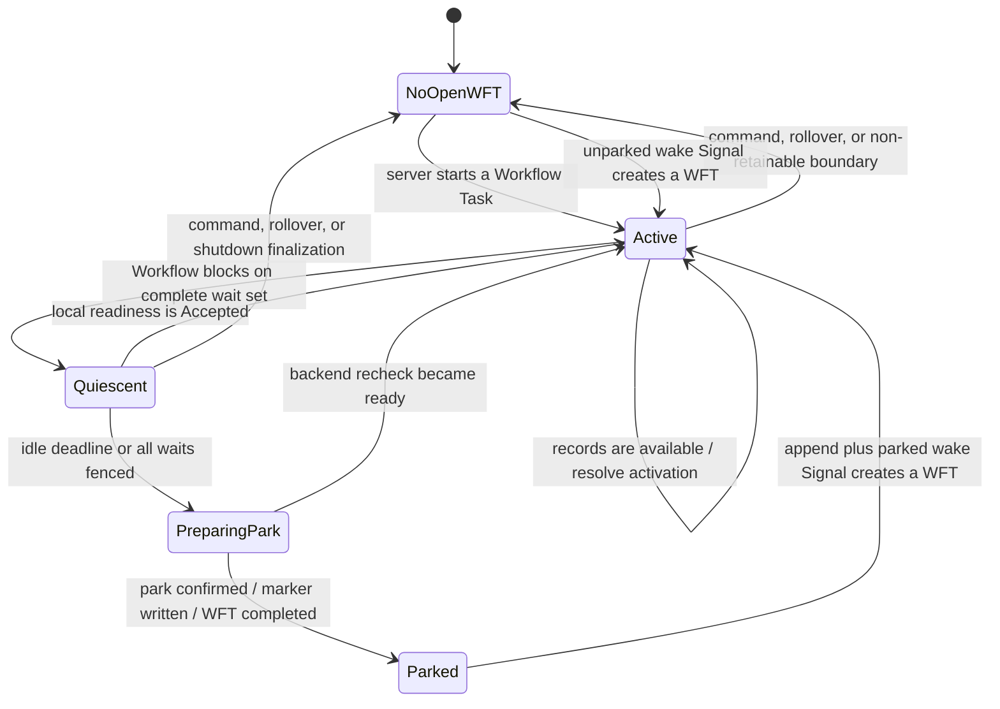
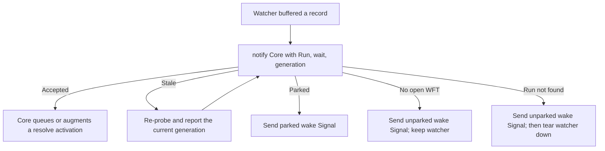

# Input and Workflow Task lifecycle

The input design keeps an open Workflow Task while a Workflow is actively consuming or briefly
waiting for records. It completes that task at a recorded boundary when the wait becomes idle, every
producer reaches a fence, a command must reach the server, or the rollover deadline wins.

## State machine

`Active`, `Quiescent`, and `PreparingPark` all have an open Workflow Task. `Parked` means the backend
park handshake is confirmed and the task has completed. `NoOpenWFT` is also healthy: it commonly
exists after a command-producing completion or rollover while subscriptions remain registered.

Normative transition rules: [`wft-lifecycle.md`](../spec/wft-lifecycle.md).

## What happens when Workflow code blocks

At each activation return, the Python runtime answers three independent questions:

1. Did replay-visible input state change? If so, it reports an observation delta.
2. Is Workflow code blocked on streams? If so, it reports the complete quiescent wait set.
3. Is there logical Workflow output? If so, it stages it or reports it as temporarily buffered.

Core may register a wait set without retaining the Workflow Task. This matters when the completion
also contains a timer, Activity, child Workflow, Signal, Query response, or rollover: the command must
reach the server, but later stream readiness still needs a registered wait to resolve.

## Retention, rollover, and parking

- One idle timer covers the complete blocked set. Different configured idle timeouts reduce to a
  deterministic minimum.
- A separate rollover deadline keeps a continuously fed stream from holding one Workflow Task until
  the server timeout.
- A per-activation record budget bounds one activation; rollover bounds the Workflow Task, not an
  activation already running.
- Parking is an all-or-nothing handshake for the complete blocked set. Python installs provider park
  intents and rechecks every member before confirming the boundary.

The final recheck closes the classic empty-check race: a concurrent append is either found by the
recheck or paired with a wake Signal. A failed, cancelled, or superseded park attempt must remove the
intents it installed.

## Readiness decision

When a watcher has buffered a record, it reports readiness to Core. The acknowledgement determines
whether local delivery was accepted or a server-visible wake is still owed.

Only `Accepted` transfers the delivery obligation completely to Core. A stale answer is retried and
the retry's answer controls the action. The other three terminal answers send the reserved Signal;
they differ in generation and watcher cleanup.

Normative result meanings: [`core-lang-protocol.md`](../spec/core-lang-protocol.md). Signal encoding,
deduplication, and retry obligations: [`wake-signal.md`](../spec/wake-signal.md).

## Three generations

| Generation | Scope | Purpose |
|---|---|---|
| Wait generation | One subscription | Rejects readiness for an earlier blocked episode |
| Quiescence generation | One complete blocked snapshot | Correlates parking and finalization with the current wait set |
| Park generation | One confirmed park | Correlates provider intents and parked wake Signals |

The park generation uses the quiescence generation that was confirmed. Generation zero is reserved
for an unparked recheck Signal.

## Why Signals never carry records

The backend remains the only stream data store. A Signal merely asks Temporal to create work when
the local Worker cannot deliver readiness into an open task. Once activated, Python rechecks all
active subscriptions rather than trusting the named topic as a complete availability statement.

This keeps History small and makes duplicate or stale wake Signals safe: they may cost an empty
Workflow Task, but they cannot introduce a duplicate payload into History.
