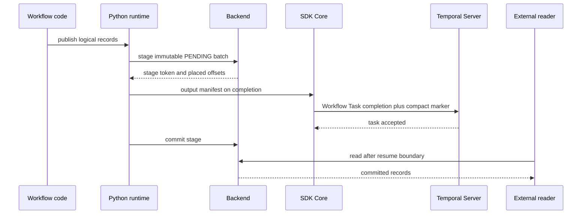
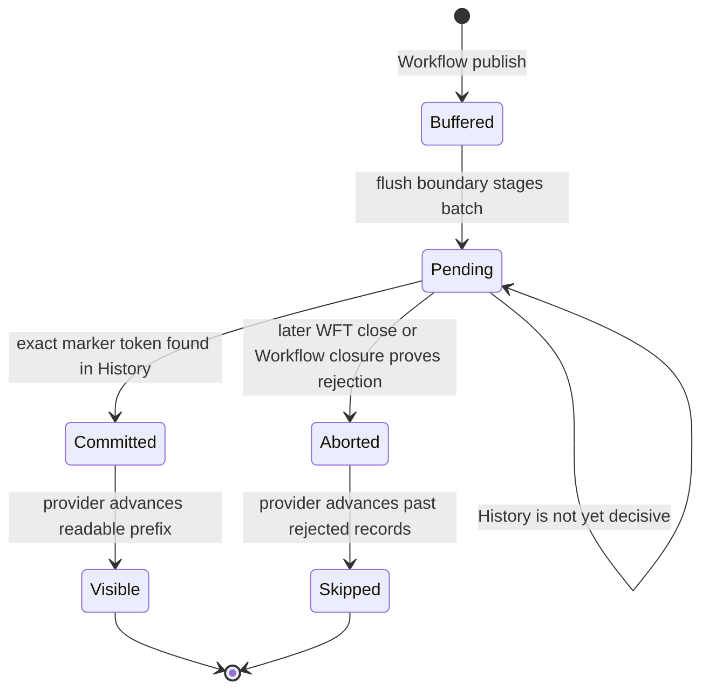

# Output commit and visibility

Workflow-originated output has one central guarantee:

> An external client may observe a batch only after the Workflow Task that produced it is durably
> committed in Temporal History.

Writing visibly before Workflow Task completion could leak output from a rejected task. Writing only
after completion could lose output when a Worker dies between the server acknowledgement and the
backend write. Staging plus a compact History proof closes both windows.

## Successful path

The manifest contains identities, counts, logical-byte totals, fingerprints, activation segmentation,
and an exact History floor—not payload bytes or provider offsets exposed to Workflow code.

## Stage state machine

Commit and abort are idempotent and irreversible. A pending batch is a per-topic ordering barrier:
later direct or Workflow output may already exist physically, but readers cannot pass it until the
pending predecessor is committed or aborted.

Normative staging and barrier rules: [`backend-contract.md`](../spec/backend-contract.md).

## What causes a flush

Workflow output is normally staged when:

- the activation already has a command that must complete the Workflow Task;
- the output visibility deadline expires;
- logical record, byte, or manifest capacity requires rollover;
- a park is confirmed; or
- another task boundary such as rollover or shutdown must be finalized.

When the Workflow is quiescent and the task can be retained, output may remain in language-runtime
memory until the earliest configured publication deadline. The output deadline, input readiness,
parking, and ordinary rollover arbitrate on Core's serialized state so only one terminal boundary and
one marker win.

Exact race behavior: [`wft-lifecycle.md`](../spec/wft-lifecycle.md).

## Recovery after Worker loss

A Worker normally commits its stage after the server accepts the Workflow Task. Recovery does not
depend on that Worker surviving:

1. A reader encounters the pending head and reads the producing Run's History strictly above the
   manifest's exact floor.
2. The exact stage token in a marker proves commit.
3. A later durable Workflow Task closing boundary or Workflow closure without that token proves
   abort.
4. If History is not decisive yet, the batch remains pending and the reader does not guess.

Unavailable Temporal or backend services are transient. History that is required for a decision but
has expired is an integrity failure, because neither visibility outcome can be proven safely.

## Direct output

Activities and external processes append output as immediately committed records. This is the better
path for token-rate or other very high-frequency output because it does not trade every latency
window for a Workflow Task lifecycle. Direct writes still obey topic ordering barriers and explicit
`FINISH` semantics.

The Workflow path and direct path have no promised global order across topics. When both publish to
one topic, applications must also designate who owns the terminal.
