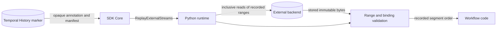
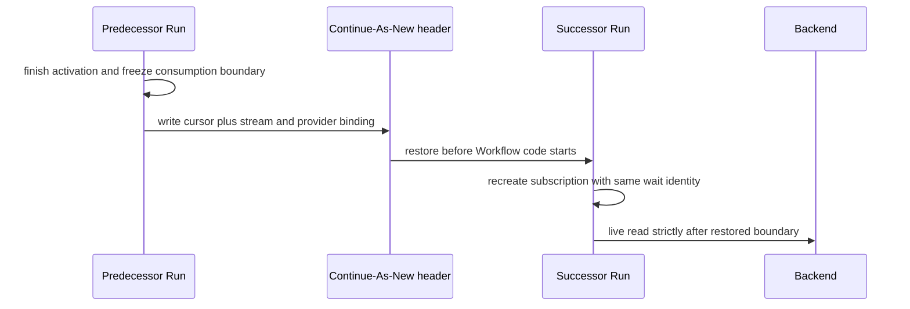

# Replay, continuation, and recovery

History does not contain stream payloads. Instead, each external-stream marker records enough
structure to fetch the exact external records again, validate them, and reproduce the order and
activation boundaries that Workflow code observed live.

## Replay path

Replay never waits for new records, starts readiness watchers, runs the idle timer, or performs the
park handshake. Backend reads still occur because payloads are external; an unavailable backend is a
storage failure rather than a nondeterminism error.

Normative annotation grammar and validation: [`annotation-format.md`](../spec/annotation-format.md).

## What the marker records

For input, the opaque annotation records:

- subscription bindings and starting cursor boundaries;
- inclusive offset ranges that were delivered;
- the cross-stream delivery schedule grouped into activation segments; and
- the terminal blocked-cursor snapshot.

For Workflow output, the marker also carries a compact logical manifest identifying the staged batch
and its activation segments. It carries counts and fingerprints, not output payloads.

Core stores and returns the input annotation as opaque bytes. Python owns its encoding and validation,
which keeps Core independent of provider offset formats and payload codecs.

## Validation model

Replay checks both external storage and Workflow code:

- Recorded ranges must still exist exactly at their first and last offsets and contain no gaps.
- Provider identity and format must match the binding under which the cursor was recorded.
- Record bytes are assumed immutable because providers must guarantee structural immutability.
- Workflow code must recreate every recorded subscription binding and consume the recorded schedule.

Missing or trimmed records are integrity loss. Present bytes that cannot be decoded are a converter
or codec mismatch. A changed subscription layout is Workflow nondeterminism. These outcomes have
different operator responses; see [`failure-taxonomy.md`](../spec/failure-taxonomy.md).

## Commit positions

It helps to distinguish four positions in the live runtime:

| Position | Meaning |
|---|---|
| Committed | Cursor recorded by an accepted marker; survives eviction |
| Consumption | Last record handed to Workflow code; feeds Continue-As-New state |
| Delivery | Last record drained into an activation; feeds the marker delta |
| Prefetch | Last record buffered by the manager; disposable on retry or eviction |

Reading, buffering, and delivery do not durably advance the stream. If a Workflow Task fails, the
runtime discards uncommitted work and reconstructs from the last accepted marker.

Normative ownership and movement of these positions:
[`python-runtime.md`](../spec/python-runtime.md).

## Continue-As-New

The continuation carries the whole binding, not just an opaque cursor. An offset has meaning only in
the provider and stream that produced it. Input cursor state and finished-output-topic state use
separate must-understand headers; an unsupported or mismatched format fails before Workflow code or
backend reads begin.

## Recovery boundaries

- A Workflow Task retry or Worker eviction repeats work from the last marker; it does not lose a
  committed record.
- A pending Workflow output stage is resolved from its exact History proof, independently of the
  original Worker.
- A parked input wake is only as durable as the component responsible for sending it. Applications
  must use a durable producer, a provider outbox, or an explicit consumer sweep where the plain
  producer crash window matters.

That last point is an intentional availability boundary, not a replay limitation. The detailed
contract is in [`wft-lifecycle.md`](../spec/wft-lifecycle.md) and
[`wake-signal.md`](../spec/wake-signal.md).
