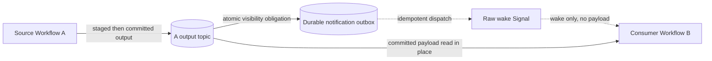

# Workflow-to-Workflow external stream subscriptions — overview

This candidate extension would allow one Workflow to consume another Workflow's committed external
output directly, without copying payloads through either Workflow's History or through a second
external stream.

> **Status:** future enhancement; not implemented and not part of the accepted specification.

## Proposed data and wake path

B would record the exact source binding and consumed ranges in its own replay marker. A's output
records would remain under A's existing output key; the design deliberately does not alias or copy
them into B's input key.

## Why existing APIs are insufficient

- A's output key identifies A, but a wake must target B.
- An evicted B has no live backend watcher, so subscriptions and notifications must be durable.
- B's current input annotation implies B's own input key and serialization context.
- B must stop at unresolved output stages until A's History proves commit or abort.

The hard part is therefore durable discovery and wakeup, not reading the payload bytes.

## Proposed additions

- An explicit source Workflow/output-topic reference and distinct Workflow-side handle.
- A provider capability for durable foreign-output registrations.
- Atomic visibility notifications plus reconciliation and notification outboxes.
- A versioned cross-Workflow wake envelope.
- Source bindings in replay annotations and Continue-As-New state.
- Replay-retention leases and a default-deny authorizer.

The first version would be same-namespace, broadcast-only, explicitly authorized, and limited to
providers capable of atomic visibility notifications.

## Decision boundary

Adopting this proposal would expand the provider, wake, replay, authorization, retention, and Core ↔
language protocols. None of those additions should appear in accepted `spec/` documents until the
proposal is approved and its required tests are defined.

For exact APIs, races, outbox semantics, failure handling, rollout, and the proposed invariant set,
read the [`detailed proposal`](workflow-to-workflow-external-streams.md).
